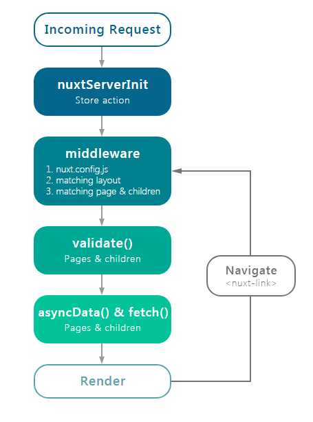

## NUXTJS

Nuxt.js是一个基于Vue.js的通用应用框架。

通过对客户端/服务器基础建构的抽象组织，Nuxt.js主要关注的是应用的UI渲染。Nuxt.js已经预设了利用Vue.js开发服务端渲染的应用所需要的各种配置。，提供了许多有用的特性，例如异步数据加载、中间件支持、布局支持等。

Nuxt.js集成了以下组件/框架：

- Vue 2
- Vue-Router
- Vuex（配置了Vuex状态树配置项）
- Vue服务端渲染
- Vue-Meta

此外，Nuxt.js使用Webpack和vue-loader、babel-loader来处理代码的自动化构建工作（如打包、代码分层、压缩等）

特性：

- 基于Vue.js
- 代码自动分层
- 服务端渲染
- 强大的路由功能，支持异步数据
- 静态文件服务
- ES2015+语法支持
- 打包和压缩JS和CSS
- HTML头部标签管理
- 本地开发支持热加载
- 集成ESLint等

Nuxt.js应用一个完整的服务器请求到渲染的流程图：



Nuxt.js和Vue.js同样可以监听目录中文件的更改，Nuxt.js运行在http://localhost:3000上运行

#### 目录

- 资源目录**assets**用于组织未编译的静态资源如LESS、SASS或JavaScript
- 组件目录**components**用于组织应用的Vue.js组件。Nuxt.js不会扩展增强该目录下Vue.js组件，即这些组件不会像页面组件那样有**asyncData**方法的特性
- 布局目录**layouts**用于组织应用的布局组件
- 中间件目录**middleware**用于存放应用的中间件
- 页面目录**pages**用于组织应用的路由及视图。Nuxt.js框架读取该目录下所有的.vue文件并自动生成对应的路由配置
- 插件目录**plugins**用于组织那些需要在**根vue.js应用**实例化之前需要运行的JavaScript插件
- 静态文件目录**static**用于存放应用的静态文件，此类文件不会被Nuxt.js调用Webpack进行构建编译处理。服务器启动的时候，该文件目录下的文件会映射至应用的根路径/下
  例如：/static/robot.txt 映射至/robot.txt
- **Store**目录用于组织应用的Vuex状态树文件，Nuxt.js框架集成了Vuex状态树的相关功能配置，在store目录下创建一个index.js文件可激活这些配置。
- **nuxt.config.js**文件用于组织Nuxt.js应用的个性化配置
- **package.json**文件用于描述应用的依赖关系和对外暴露的脚本接口
- 别名：
  ~ 或@ 对应srcDir
  ~~或@@ 对应rootDir

#### 路由

Nuxt.js依据pages目录结构自动生成vue-router模块的路由配置。

例如pages目录结构如下：

```
pages/
--| user/
-----| index.vue
-----| one.vue
--| index.vue
```

那么，Nuxt.js自动生成的路由配置如下：

```
router: {
  routes: [
    {
      name: 'index',
      path: '/',
      component: 'pages/index.vue'
    },
    {
      name: 'user',
      path: '/user',
      component: 'pages/user/index.vue'
    },
    {
      name: 'user-one',
      path: '/user/one',
      component: 'pages/user/one.vue'
    }
  ]
}
```

**中间件**允许定义一个自定义函数运行在一个页面或一组页面渲染之前，每个中间件应放置在middleware/目录下，文件名称将称为中间件名称（middleware/auth.js将成为auth中间件）

一个中间件接收context作为第一个参数：

```
export default function (context) {
  context.userAgent = process.server ? context.req.headers['user-agent'] : navigator.userAgent
}
```

中间件执行流程顺序：

1、nuxt.config.js

2、匹配布局

3、匹配页面

中间件可以异步执行，只需要返回一个Promise或使用第2个callback作为第一个参数

```
middleware/stats.js
import axios from 'axios'

export default function ({ route }) {
  return axios.post('http://my-stats-api.com', {
    url: route.fullPath
  })
}
```

然后在你的 `nuxt.config.js` 、 layouts 或者 pages 中使用中间件:

```
nuxt.config.js
module.exports = {
  router: {
    middleware: 'stats'
  }
}
```

现在，`stats` 中间件将在每个路由改变时被调用。

您也可以将 middleware 添加到指定的布局或者页面:

```
pages/index.vue` 或者 `layouts/default.vue
export default {
  middleware: 'stats'
}
```

#### 页面

页面组件实际上是Vue组件，只不过Nuxt.js为这些组件添加了一些特殊的配置项（对应Nuxt.js提供的功能特性）以便能快速开发通用应用。

```
<template>
  <h1 class="red">Hello {{ name }}!</h1>
</template>

<script>
export default {
  asyncData (context) {
    // called every time before loading the component
    return { name: 'World' }
  },
  fetch () {
    // The fetch method is used to fill the store before rendering the page
  },
  head () {
    // Set Meta Tags for this Page
  },
  // and more functionality to discover
  ...
}
</script>

<style>
.red {
  color: red;
}
</style>
```

Nuxt.js为页面提供的特殊配置项：

- **asyncData**：最重要的一个键，支持异步数据处理，另外该方法第一个参数为当前页面组件的上下文对象
- **fetch**：与asyncData方法类似，用于在渲染页面之前获取数据填充应用的状态树（store），但fetch方法不会设置组件的数据。
- **head**：配置当前页面的Meta标签
- **layout**：指定当前页面使用的布局
- **loading**：如果设置为false，则组织页面自动调用this.$nuxt.$loading.finish()和this.$nuxt.$loading.start()
- **validate**: 校检方法用于校检动态路由的参数
- **middleware**： 指定页面之间的中间件，中间件会在页面渲染之前调用。

#### 异步数据

asyncData方法会在组件上（限于页面组件）每次加在之前被调用，它可以在服务端或路由更新之前被调用。在这个方法被调用的时候，第一个参数被设定为当前页面的上下文对象，可以利用asyncData方法来获取数据，Nuxt.js会将asyncData返回的数据融合组件data的方法返回的数据一并返回给当前组件。

注意：asyncData方法是在组件初始化前被调用的，所以在方法内是没有办法通过this来引用组件的实例对象。

```
export default {
  async asyncData ({ params }) {
    const { data } = await axios.get(`https://my-api/posts/${params.id}`)
    return { title: data.title }
  }
}
```


对于非JavaScript文件，Nuxt.js通过配置Webpack使用file-loader和url-loader这两个加载器来处理此类引用。

Nuxt.js默认的加载器配置：

```
[
  {
    test: /\.(png|jpe?g|gif|svg)$/,
    loader: 'url-loader',
    query: {
      limit: 1000, // 1KB
      name: 'img/[name].[hash:7].[ext]'
    }
  },
  {
    test: /\.(woff2?|eot|ttf|otf)(\?.*)?$/,
    loader: 'url-loader',
    query: {
      limit: 1000, // 1 KB
      name: 'fonts/[name].[hash:7].[ext]'
    }
  }
]
```

#### **NUXT.JS之API**：

1. 上下文对象Context：

   | 属性字段  | 类型           | 可用           | 描述                                                         |
   | --------- | -------------- | -------------- | ------------------------------------------------------------ |
   | app       | Vue根实例      | 客户端、服务端 | 包含所有插件的Vue根实例，例如在使用axios的时候，可以通过context.app.$axios来获取 |
   | route     | Vue Router路由 | 客户端、服务端 | VueRouter路由实例                                            |
   | store     | Vuex数据       | 客户端、服务端 | Vuex.Store实例，只有vuex数据流存在相关配置时可用             |
   | env       | Object         | 客户端、服务端 | nuxt.config.js中配置的环境变量                               |
   | params    | Object         | 客户端、服务端 | route.params的别名                                           |
   | query     | Object         | 客户端、服务端 | route.query的别名                                            |
   | req       | http.Request   | 服务端         | Node.jsAPI的Request对象                                      |
   | res       | http.Response  | 服务端         | Node.jsAPI的Response对象                                     |
   | reqdirect | Function       | 客户端、服务端 | 用这个方法重定向用户请求到另一个路由。状态码在服务端被使用，redirect（[status,]path[,query]） |
   | error     | Function       | 客户端、服务端 | 用这个方法展示错误页：error（params）。params参数应该包含statusCode和message字段 |
   | nuxtState | Object         | 客户端         | Nuxt状态，在使用beforeNuxtRender之前，用于客户端获取Nuxt状态，仅在universal模式下可用。 |

2. asyncData方法在上边。

3. fetch方法用于在渲染页面前填充应用的状态树（store）数据

4. head方法用于设置当前页面 的头部标签，在head方法中可以通过this关键字获取组件的数据。

5. key属性赋值到\<router-view>,这对于在动态页面和不同路径中进行转换很有用。

6. loading属性，默认情况下使用自己的组件来显示路由跳转之间的进度条。

7. transition属性，通过\<transtition>组件来实现路由切换时的过渡动效。


## Axios

Axios是一个基于promise的HTTP库，可以用在浏览器和node.js中。

Axios具有的特性：

- 从浏览器中创建XMLHttpRequests
- 从node.js创建http请求
- 支持Promise API
- 拦截请求和响应
- 转换请求数据和响应数据
- 取消请求
- 自动转换JSON数据
- 客户端支持防御XSRF

执行GET请求

```
// 为给定 ID 的 user 创建请求
axios.get('/user?ID=12345')
  .then(function (response) {
    console.log(response);
  })
  .catch(function (error) {
    console.log(error);
  });

// 上面的请求也可以这样做
axios.get('/user', {
    params: {
      ID: 12345
    }
  })
  .then(function (response) {
    console.log(response);
  })
  .catch(function (error) {
    console.log(error);
  });
```

执行POST请求

```
axios.post('/user', {
    firstName: 'Fred',
    lastName: 'Flintstone'
  })
  .then(function (response) {
    console.log(response);
  })
  .catch(function (error) {
    console.log(error);
  });
```

在**Vue**中使用axios的时候要注意区分params和data的区别，尤其注意data里数据的格式，PUT或者POST传的多数是data，而Get或DELETE传的多数是params。如果要是post数据的话，提前使用postman来GET一下数据库中的JSON数据格式可能会更好理解的。

```
async handleData(row) {
	await this.$axios.$get(`/user/${id}`, {
	params: {id: this.id}
	})
}
async handleData2(row) {
	await this.$axios.$post('/user',{
	id: row.id,
	name: row.name
	})
}
```

在页面初始化前需要获得数据，也就是异步请求数据。Nuxt.js为我们提供了Vue.js的方法，增加了asyncData(){}.

```
async asyncData({app}) {
	const userList = await app.$axios.$get('/user')
	return userList
}
```

同时，在methods、created和mounted中都可以使用，使用方法如上。

### 请求配置

```
{
	// 'url'用于请求的服务器的URL
	url: '/user',
	// 'method' 是创建请求时使用的方法
	method: 'get',
	// 'baseURL' 将自动加在'url'前面，除非'url'是一个绝对的URL。
	// 它可以通过设置一个'baseURL',便于为axios实例的方法传递相对URL
	baseURL: 'https://some-domain.com/api/',
	// 'transformRequest'允许在向服务器发送前，修改请求数据
	// 只能用在’PUT','POST'和'PATCH'，这几个请求方法
	// 后面数组中的函数必须返回一个字符创，或ArrayBuffer，或Stream
	transformRequest: [function (data, headers) {
		// 对 data进行任意转换处理
		return data;
	}],
	// 'headers' 是即将被发送的自定义请求头
	headers: {'X-Requested-With': 'XMLHttpRequest'},
	// 'params' 是即将与请求一起发送的URL参数
	// 必须是一个无格式对象(plain object)或 URLSearchParams对象
	params: {
		ID: 12345
	},
	// `paramsSerializer` 是一个负责 `params` 序列化的函数
  // (e.g. https://www.npmjs.com/package/qs, http://api.jquery.com/jquery.param/)
  paramsSerializer: function(params) {
    return Qs.stringify(params, {arrayFormat: 'brackets'})
  },

  // `data` 是作为请求主体被发送的数据
  // 只适用于这些请求方法 'PUT', 'POST', 和 'PATCH'
  // 在没有设置 `transformRequest` 时，必须是以下类型之一：
  // - string, plain object, ArrayBuffer, ArrayBufferView, URLSearchParams
  // - 浏览器专属：FormData, File, Blob
  // - Node 专属： Stream
  data: {
    firstName: 'Fred'
  },

  // `timeout` 指定请求超时的毫秒数(0 表示无超时时间)
  // 如果请求话费了超过 `timeout` 的时间，请求将被中断
  timeout: 1000,

   // `withCredentials` 表示跨域请求时是否需要使用凭证
  withCredentials: false, // default

  // `adapter` 允许自定义处理请求，以使测试更轻松
  // 返回一个 promise 并应用一个有效的响应 (查阅 [response docs](#response-api)).
  adapter: function (config) {
    /* ... */
  },

 // `auth` 表示应该使用 HTTP 基础验证，并提供凭据
  // 这将设置一个 `Authorization` 头，覆写掉现有的任意使用 `headers` 设置的自定义 `Authorization`头
  auth: {
    username: 'janedoe',
    password: 's00pers3cret'
  },

   // `responseType` 表示服务器响应的数据类型，可以是 'arraybuffer', 'blob', 'document', 'json', 'text', 'stream'
  responseType: 'json', // default

  // `responseEncoding` indicates encoding to use for decoding responses
  // Note: Ignored for `responseType` of 'stream' or client-side requests
  responseEncoding: 'utf8', // default

   // `xsrfCookieName` 是用作 xsrf token 的值的cookie的名称
  xsrfCookieName: 'XSRF-TOKEN', // default

  // `xsrfHeaderName` is the name of the http header that carries the xsrf token value
  xsrfHeaderName: 'X-XSRF-TOKEN', // default

   // `onUploadProgress` 允许为上传处理进度事件
  onUploadProgress: function (progressEvent) {
    // Do whatever you want with the native progress event
  },

  // `onDownloadProgress` 允许为下载处理进度事件
  onDownloadProgress: function (progressEvent) {
    // 对原生进度事件的处理
  },

   // `maxContentLength` 定义允许的响应内容的最大尺寸
  maxContentLength: 2000,

  // `validateStatus` 定义对于给定的HTTP 响应状态码是 resolve 或 reject  promise 。如果 `validateStatus` 返回 `true` (或者设置为 `null` 或 `undefined`)，promise 将被 resolve; 否则，promise 将被 rejecte
  validateStatus: function (status) {
    return status >= 200 && status < 300; // default
  },

  // `maxRedirects` 定义在 node.js 中 follow 的最大重定向数目
  // 如果设置为0，将不会 follow 任何重定向
  maxRedirects: 5, // default

  // `socketPath` defines a UNIX Socket to be used in node.js.
  // e.g. '/var/run/docker.sock' to send requests to the docker daemon.
  // Only either `socketPath` or `proxy` can be specified.
  // If both are specified, `socketPath` is used.
  socketPath: null, // default

  // `httpAgent` 和 `httpsAgent` 分别在 node.js 中用于定义在执行 http 和 https 时使用的自定义代理。允许像这样配置选项：
  // `keepAlive` 默认没有启用
  httpAgent: new http.Agent({ keepAlive: true }),
  httpsAgent: new https.Agent({ keepAlive: true }),

  // 'proxy' 定义代理服务器的主机名称和端口
  // `auth` 表示 HTTP 基础验证应当用于连接代理，并提供凭据
  // 这将会设置一个 `Proxy-Authorization` 头，覆写掉已有的通过使用 `header` 设置的自定义 `Proxy-Authorization` 头。
  proxy: {
    host: '127.0.0.1',
    port: 9000,
    auth: {
      username: 'mikeymike',
      password: 'rapunz3l'
    }
  },

  // `cancelToken` 指定用于取消请求的 cancel token
  // （查看后面的 Cancellation 这节了解更多）
  cancelToken: new CancelToken(function (cancel) {
  })
}
}
```


## VUEX

Vuex是一个专为Vue.js应用程序开发的状态管理模式，它采用集中式存储管理应用的所有组件的状态，并以相应的规则保证状态以一种可预测的方式发生变化。

应用示例：

```
new Vue({
  // state
  data () {
    return {
      count: 0
    }
  },
  // view
  template: `
    <div>{{ count }}</div>
  `,
  // actions
  methods: {
    increment () {
      this.count++
    }
  }
})
```

这个状态自管理应用包含三个部分：

- state，驱动应用的数据源
- view，以声明方式将state映射到视图
- actions，响应在view上的用户输入导致的状态变化。


上面是一个“单项数据流”，如果我们的应用遇到多个组件共享状态时，单项数据流的简洁性很容易被破坏：

- 多个视图依赖于同一状态
- 来自不同视图的行为需要变更同一状态

对于第一个问题，传参的方法对于多层嵌套的组件将会非常繁琐，并且对于兄弟组件间的状态传递无能为力，

对于第二个问题，我们经常会采用父子组件直接引用或者通过事件来变更同步状态的多份拷贝。

如果将组件的共享状态抽取出来，以一个全局单例模式管理，在这种模式下，我们的组件树构成了一个巨大的“视图”，不管在树的哪个位置，任何组件都能获取状态或者触发行为。通过定义和隔离状态管理中的各种概念并通过强制规则维持视图和状态间的独立性，代码将会变得更结构化且易维护。

每一个Vuex应用的核心就是store（仓库）。“store”基本就是一个容器，它包含着你的应用中大部分的状态（state）。Vuex和单纯的全局对象有两点不同：

- Vuex的状态存储是响应式的，当Vue组件从store中读取状态的时候，若store中的状态发生变化，那么相应的组件也会相应地得到高效更新。
- 不能直接改变store中的状态。改变store中的状态的唯一途径就是显式地提交（commit）mutation。这样使得我们可以方便地跟踪每一个状态的变化，从而让我们能够实现一些工具帮助更好地了解我们的应用。

stroe示例：

```
Vue.use(Vuex)
const store = new Vuex.Store({
	state:{
	count:0
	},
	mutations:{
		increment (state) {
			state.count++
		}
	}
})
```

可以通过store.state来获取状态对象，以及通过store.commit方法触发状态变更：

```
store.commit('increment')
console.log(store.state.count)
```

需要注意的是，我们通过提交mutation的方式，而非直接改变store.state.count，是因为我们想要更明确地追踪到状态的变化。由于store中的状态是响应式的，在组件中调用store中的状态简单到仅需要在计算属性中返回即可。触发变化也仅仅是在组件的methods中提交mutation。

#### 核心概念

##### State

Vuex使用单一状态树，用一个对象就包含了全部的应用层级状态。这意味着每个应用将仅仅包含一个store实例。

在Vue组件中获得Vuex状态，从store实例中读取状态最简单的方法就是在计算属性中返回某个状态。

```
// 创建一个 Counter 组件
const Counter = {
  template: `<div>{{ count }}</div>`,
  computed: {
    count () {
      return store.state.count
    }
  }
}
```

每当store.state.count变化的时候，都会重新求取计算属性，并且触发更新相关连的DOM。

Vuex通过store选项，提供了一种机制将状态从根组件“注入”到每个子组件中：

```
const app = new Vue({
  el: '#app',
  // 把 store 对象提供给 “store” 选项，这可以把 store 的实例注入所有的子组件
  store,
  components: { Counter },
  template: `
    <div class="app">
      <counter></counter>
    </div>
  `
})
```

通过在根实例中注册store选项，该store实例会注入到根组件下的所有子组件中，且子组件能通过this.$store访问到。

```
const Counter = {
  template: `<div>{{ count }}</div>`,
  computed: {
    count () {
      return this.$store.state.count
    }
  }
}
```

##### mapState辅助函数

当一个组件需要获取多个状态时，将这些状态都声明为计算属性会有些重复和冗余。为了解决这个问题，我们可以使用mapState辅助函数帮助我们生成计算属性，让你少按几次键。

```
// 在单独构建的版本中辅助函数为 Vuex.mapState
import { mapState } from 'vuex'

export default {
  // ...
  computed: mapState({
    // 箭头函数可使代码更简练
    count: state => state.count,

    // 传字符串参数 'count' 等同于 `state => state.count`
    countAlias: 'count',

    // 为了能够使用 `this` 获取局部状态，必须使用常规函数
    countPlusLocalState (state) {
      return state.count + this.localCount
    }
  })
}
```

mapState函数返回的是一个对象，优势我们需要使用一个工具函数将多个对象合并为一个可以使用对象展开运算符简化写法：

```
computed: {
  localComputed () { /* ... */ },
  // 使用对象展开运算符将此对象混入到外部对象中
  ...mapState({
    // ...
  })
}
```

当然，使用Vuex并不意味着你需要将所有的状态放入Vuex，虽然将所有的状态放到Vuex会使状态变化更显式和易调试，但也会使得代码变得冗长和不直观。

##### Getter

Vuex允许我们在store中定义“getter”（可以认为是store的计算属性）。就像计算属性一样，getter的返回值会根据它的依赖被缓存起来，且只有当它的依赖值发生了改变才会被重新计算。

##### Mutation

更改Vuex的store中的状态的唯一方法就是提交mutation。Vuex中的mutation非常类似与事件：每个mutation都有一个字符串的事件类型（type）和一个回调函数（handler）。这个回调函数就是我们实际进行状态更改的地方，并且它会接受state作为第一个参数：

```
const store = new Vuex.Store({
  state: {
    count: 1
  },
  mutations: {
    increment (state) {
      // 变更状态
      state.count++
    }
  }
})
```

##### Action

Action类似于mutation，不同在于：

- Action提交的是mutation，而不是直接改变状态
- action可以包含任意异步操作

```
const store = new Vuex.Store({
  state: {
    count: 0
  },
  mutations: {
    increment (state) {
      state.count++
    }
  },
  actions: {
    increment (context) {
      context.commit('increment')
    }
  }
})
```

Action函数接受一个store实例具有相同方法和属性的context对象，因此你可以调用context.commit提交一个mutation，或者通过context.state和context.getters来获取state和getters。

##### Module

Vuex允许我们将store分割成模块（module）。每个模块拥有自己的state、mutation、action、getter、甚至是嵌套子模块：

```
const moduleA = {
  state: { ... },
  mutations: { ... },
  actions: { ... },
  getters: { ... }
}

const moduleB = {
  state: { ... },
  mutations: { ... },
  actions: { ... }
}

const store = new Vuex.Store({
  modules: {
    a: moduleA,
    b: moduleB
  }
})

store.state.a // -> moduleA 的状态
store.state.b // -> moduleB 的状态
```

