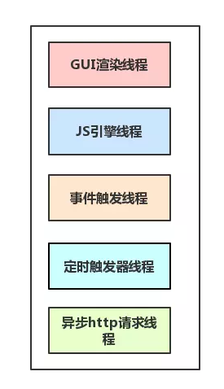
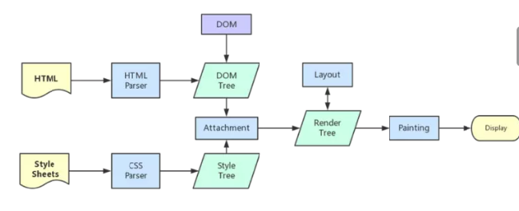
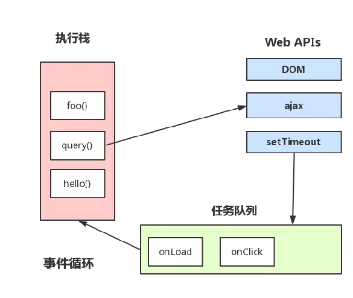

# JavaScript运行机制


内容简介：从静态网页和动态网页到浏览器进程，再到浏览器内核进行，再到JS引擎单线程，再到JS事情循环机制。

## 静态网页

纯粹HTML格式的网页通常被称为“静态网页”，静态网页是标准的HTML文件，可以包含文本、图像、声音、FLASH动画、客户端脚本和Active控件及JAVA小程序等。静态网页是相对于动态网页而言，是指没有后台数据库、不含程序和不可交互的网页。实际上静态也不是完全静态，可以出现各种动态的效果，如GIF格式的动画、FLASH、滚动字幕等。

## 动态网页

动态网页页面代码虽然没有变，但是显示的内容却是可以随着时间、环境或者数据库操作的结果而发生改变的。动态网页是基本的html语法规范与Java、VB、VC等高级程序设计语言、数据库编程等多种技术的融合，以期实现对网站内容和风格的高效、动态和交互式的管理。从此意义上来讲，凡是结合了HTML以外的高级程序语言和数据库技术进行的网页编程技术生成的网页都是动态网页。

特征：

- 动态网页一般以数据库技术为基础，可以大大降低网站维护的工作量；
- 采用动态网页技术的网站可以实现更多的功能，如：用户注册、用户登录、在线调查、用户管理、订单管理等等；
- 动态网页实际上并不是独立存在与服务器上的网页文件，只有当用户请求时服务器才返回一个完整的网页；
- 动态网页中的“？”对搜索引擎检索存在一定的问题，搜索引擎一般不可能从一个网站的数据库中访问全部网页，或者出于技术方面的考虑，搜索之中不去抓取网址中“？”后面的内容，因此采用动态网页的网站在进行搜索引擎推广时需要做一定的技术处理才能适应搜索引擎的要求。

## 区分进程和线程

```
形象比喻：
进程是一个工厂，工厂有它自己的独立资源
工厂之间相互独立
线程是工厂中的工人，多个工人协作完成任务
工厂内有一个或多个工人
工人之间共享空间
```

```
完善概念：
工厂的资源 -> 系统分配的内容
工厂之间的相互独立 -> 进程之间相互独立
多个工人协作完成任务 -> 多个线程在进程中协作完成任务
工厂内有一个或多个工人 -> 一个进程由一个或多个线程组成
工人之间共享内存 -> 同一进程下的各个线程之间共享程序的内存空间（包括代码段、数据集、堆等）
```


## 浏览器是多进程的

- 浏览器是多进程的
- 浏览器之所以能够运行，是因为系统给它的进程分配了资源（CPU、内存）
- 每打开一个tab页，就相当于创建了一个独立的浏览器进程。


## 浏览器包含哪些进程？

1、Browser进程：浏览器的主进程（负责协调、主控），只有一个。作用：

- 负责浏览器页面显示，与用户交互，例如前进、后退
- 负责各个页面的管理，创建和销毁其他进程
- 将Render进程得到的内存中的Bitmap，绘制到用户界面上
- 网络资源的管理，下载等

2、第三方插件进程：每种类型的插件对应一个进程，仅当使用该插件时才创建

3、GPU进程：最后一个，用于3D绘制等

4、浏览器渲染进程（浏览器内核）（Render进程，内部是多线程的）：默认每个Tab页面一个进程，互不影响，主要作用为：页面渲染，脚本执行，事件处理等


## 浏览器多进程的优势

- 避免单个page crash影响整个浏览器
- 避免第三方插件crash影响整个浏览器
- 多进程充分利用多核优势
- 方便使用沙盒模型隔离插件等进程，提高浏览器稳定性


## 浏览器内核（渲染进程）

浏览器渲染进程是多线程的：

1、GUI渲染线程

- 负责渲染浏览器界面，解析HTML,CSS，构建DOM树和RenderObject树，布局和绘制等
- 当界面需要重新绘制（Repaint）或者由于某种操作引发回流（reflow）时，该线程就会执行
- GUI渲染线程与JS引擎线程是互斥的，当JS引擎执行时GUI线程会被挂起，GUI更新会保存在一个队列中等到JS引擎空闲时立即被执行。

2、JS引擎线程

- JS内核，负责处理JavaSript脚本程序
- JS引擎线程负责解析JavaScript脚本，运行代码
- JS引擎一直等待着任务队列中任务的到来，然后加以处理，一个Tab页（render进程）中无论什么时候都只有一个JS线程在运行JS程序
- 如果JS执行的时间过程，就会造成页面的渲染不连贯，导致页面渲染加载阻塞

3、事件触发线程

- 归属浏览器而不是JS引擎，用来控制事件循环（可以理解，JS引擎自己都忙不过来，需要浏览器另开线程协助）
- 当JS引擎执行代码块如setTimeOut时（也可来自浏览器内核的其他线程，如鼠标点击、AJAX异步请求等），会将对应任务添加到事件线程中
- 当对应的事件符合触发条件被触发时，该线程会把事件添加到待处理队列的队尾，等待JS引擎的处理
- 由于JS的单线程关系，这些待处理队列中的事情都得排队等待JS引擎处理（当JS引擎空闲时才会去执行）

4、定时触发器线程

- setInterval和setTimeOut所在线程
- 浏览器定时计数器并不是有JS引擎计数的
- 通过单线程来计时并触发定时（计时完毕后，添加到事件队列中，等待JS引擎空闲后执行）

5、异步http请求线程

- 在XMLHttpRequest在连接后是通过浏览器新开一个线程请求
- 将检测到状态变更时，如果设置有回调函数，异步线程就产生状态变更事件，将这个回调再放入事件队列中，在，再有JavaScript引擎执行。




## Browser进程和浏览器内核（Render进程）的通信过程

- Browser进程受到用户请求，首先需要获取页面内容（通过网络下载资源），随后将该任务通过RenderHost接口传递给Render进程
- Render进程的Render接口收到消息，简单解释后，交给渲染线程，然后开始渲染
- 渲染线程接收请求，加载网页并渲染网页，这其中可能需要Browser进程获取资源和需要GPU进程来帮助渲染
- 当然可能会有JS线程操作DOM
- 最后Render进程将结果传给Browser进程
- Browser进程接收到结果并将结果绘制出来。


## GUI渲染线程与JS引擎线程互斥

由于JavaScript是可操纵DOM的，如果在修改这些元素属性同时渲染界面（JS线程和UI线程同时运行），那么渲染线程前后获得的元素数据就可能不一致了。

为了防止渲染出现不可预期的结果，浏览器设置GUI渲染线程与JS引擎为互斥关系，当JS引擎执行是GUI线程会被挂起。

GUI更新则会被保存在一个队列中等到JS引擎线程空闲时立即被执行。

## 梳理浏览器渲染流程

前期工作：

浏览器输入url，浏览器主进程接管，开始一个下载线程

然后进行http请求（DNS查询，IP寻址等），然后等待响应，获取内容，

随后将内容通过RenderHost接口转给Render进程

浏览器渲染步骤：

1、解析html建立dom树

2、解析css构建render树（将CSS代码解析成树形的数据结构，然后结合DOM合并成render树）

3、布局render树（Layout/reflow），负责各元素尺寸、位置的计算

4、绘制render树（paint），绘制页面像素信息

5、浏览器将会将各层的信息发送给GPU，GPU会将各层合成（composite），显示在屏幕上。




## 事情循环机制





主线程在运行时会产生执行栈，栈中的代码调用某些api时，它们会在事件队列中添加各种事件（当满足触发条件后，如ajax请求完毕）

栈中的代码执行完毕，就会读取事件队列中的事件，去执行那些回调

总是要等待栈中的代码执行完毕后才会去读取事件队列的事件


